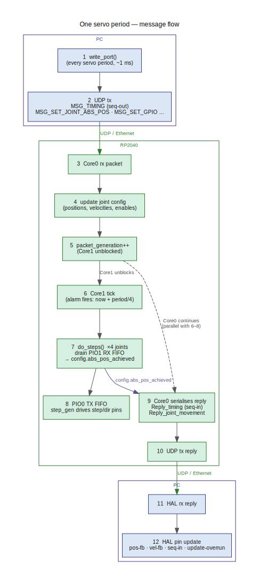

# Message flow

One complete servo period from LinuxCNC's perspective.

---

## One servo period, step by step

1. **`write_port()` called** — LinuxCNC's HAL scheduler calls the driver function at the
   start of every servo period (typically every 1 ms).

2. **UDP tx** — the driver packs one or more messages into a `NWBuffer`, stamps the current
   cycle count as `seq-out` (carried in `MSG_TIMING.update_id`), and sends the datagram to
   the RP2040 at 192.168.12.2:5002.

3. **Core0 rx packet** — Core0 is blocked on `recvfrom()`; it wakes immediately when the
   datagram arrives (the W5500 delivers the complete datagram atomically).

4. **Update joint config** — Core0 dispatches each message type: `MSG_SET_JOINT_ABS_POS`
   writes target positions and velocities, `MSG_SET_GPIO` sets output pin states,
   `MSG_SET_JOINT_CONFIG` updates per-joint parameters, and so on.

5. **`packet_generation++`** — after all config writes from this packet are committed,
   Core0 increments the shared `packet_generation` counter. Core1 is spinning on this
   value and unblocks as soon as it advances.

6. **Core1 tick** — Core1 was sleeping until the hardware alarm fired (scheduled at
   `now + period/4` by `recover_clock()`). After the alarm it spins until
   `packet_generation` advances, then proceeds with fresh config.

7. **`do_steps()`** — Core1 calls `do_steps()` for each enabled joint, converting the
   requested velocity into a pulse-length and planning how many steps to generate this
   period.

8. **PIO TX FIFO** — step commands are pushed to PIO0's TX FIFO. The `step_gen` state
   machine picks them up and drives the step/direction GPIO pins.

9. **Core0 serialises reply** *(parallel with steps 6–8)* — Core0 reads position counters
   from PIO1's RX FIFO, assembles `Reply_timing` (echoing `update_id` as `seq-in`),
   `Reply_joint_movement`, `Reply_joint_metrics`, and any other pending replies.

10. **UDP tx reply** — Core0 sends the reply datagram back to the PC.

11. **HAL rx reply** — the driver's receive path (also inside `write_port()`) calls
    `recvfrom()` with a short timeout. If a reply arrives it is unparsed.

12. **HAL pin update** — position, velocity, and diagnostic values are written to HAL
    output pins (`pos-fb`, `vel-fb`, `seq-in`, `update-overrun`, etc.) ready for the
    next LinuxCNC servo cycle.

---

## UDP packet structure

Messages are carried in a `NWBuffer`:

| Field | Size | Description |
|-------|------|-------------|
| length | 2 bytes | total payload byte count |
| checksum | 2 bytes | simple byte sum of payload (redundant — UDP already checksums) |
| payload | up to 256 bytes | packed sequence of messages |

Each message begins with a 1-byte type field. Multiple messages are packed back-to-back.
A zero byte (MSG_NONE) terminates the list.

---

## Startup handshake

Before the normal per-period loop begins, the driver sends `MSG_VERSION_REQUEST` on every
cycle until it receives a `REPLY_VERSION`. The firmware replies with its
`PROTOCOL_VERSION_MAJOR/MINOR/PATCH` from `src/shared/version.h`. If the versions match
the driver logs `INFO: version OK (M.N.P)` and proceeds; if they differ it logs
`ERROR: version mismatch` and continues (but data may be corrupted). The check resets on
link-down so it is repeated after every reconnect.

The protocol version patch number is auto-incremented by the pre-commit hook on every
commit. Major/minor are bumped manually when the wire format changes.

---

## Message types

### Host → RP2040 (MSG_*)

| Type | Value | Key fields | Purpose |
|------|-------|-----------|---------|
| `MSG_VERSION_REQUEST` | 1 | — | Request firmware protocol version |
| `MSG_TIMING` | 2 | `update_id`, `time` | Heartbeat; carries sequence number and host timestamp |
| `MSG_SET_JOINT_ENABLED` | 3 | `joint`, `value` | Enable or disable a single joint |
| `MSG_SET_JOINT_ABS_POS` | 4 | `position[8]`, `velocity[8]` | Set target position and velocity for all joints |
| `MSG_SET_JOINT_CONFIG` | 5 | `joint`, `gpio_step`, `gpio_dir`, `max_velocity`, `max_accel` | Per-joint hardware config |
| `MSG_SET_GPIO` | 6 | `bank`, `values`, `confirmation_pending` | Set output state for a 32-bit bank of GPIO |
| `MSG_SET_GPIO_CONFIG` | 7 | `gpio_type`, `index`, `address` | Configure a single GPIO pin type |
| `MSG_SET_SPINDLE_CONFIG` | 8 | `spindle_index`, `modbus_address`, `vfd_type`, `bitrate` | Spindle driver config |
| `MSG_SET_SPINDLE_SPEED` | 9 | `speed[4]` | Set spindle speed |

### RP2040 → Host (REPLY_*)

| Type | Value | Key fields | Purpose |
|------|-------|-----------|---------|
| `REPLY_VERSION` | 1 | `version_major`, `version_minor`, `version_patch` | Firmware protocol version response |
| `REPLY_TIMING` | 2 | `update_id`, `time_diff`, `rp_update_len` | Echoes `update_id` (seq-in); RP processing time |
| `REPLY_JOINT_MOVEMENT` | 3 | `abs_pos_achieved[8]`, `velocity_achieved[8]`, `enabled[8]`, `update_period_us` | Position and velocity feedback |
| `REPLY_JOINT_CONFIG` | 4 | mirrors `MSG_SET_JOINT_CONFIG` | Config echo/acknowledgement |
| `REPLY_JOINT_METRICS` | 5 | `overrun_occurred`, `underrun_occurred` | Per-period overrun/underrun flags |
| `REPLY_GPIO` | 6 | `bank`, `values` | Current GPIO input state |
| `REPLY_GPIO_CONFIG` | 7 | mirrors `MSG_SET_GPIO_CONFIG` | Config echo |
| `REPLY_SPINDLE_SPEED` | 8 | `speed`, `crc_errors`, `unanswered` | Spindle speed and Modbus diagnostics |
| `REPLY_SPINDLE_CONFIG` | 9 | mirrors `MSG_SET_SPINDLE_CONFIG` | Config echo |

---

## Latency tracking

Three HAL pins track network health:

- **`seq-out`** — incremented by the driver on every sent packet (= `MSG_TIMING.update_id`).
- **`seq-in`** — the `update_id` echoed back by the RP2040 in `REPLY_TIMING`. The
  difference `seq-out − seq-in` is the round-trip latency in servo cycles; under normal
  conditions this is 1.
- **`rx-miss-count`** — counts consecutive cycles without a valid reply. Resets to 0 on
  success.

---

## Network timeout

After `MAX_SKIPPED_PACKETS` (10) consecutive cycles without a reply, the driver treats the
connection as down: joints are disabled and `rx-miss-count` continues to increment. When
packets resume, `rx-miss-count` resets and joints can be re-enabled by LinuxCNC through
the normal `MSG_SET_JOINT_ENABLED` protocol.
