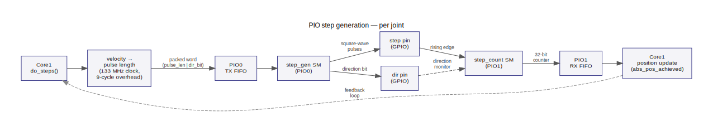

# PIO step generation

How the RP2040 PIO hardware generates step pulses and counts position.



---

## State machine allocation

The RP2040 has two PIO blocks (PIO0, PIO1), each with four state machines — eight SMs
total. `MAX_JOINT` (set at build time via `-DMAX_JOINT=N`, default 4) controls how many
joints receive step generation. All remaining SMs are allocated to step_count feedback,
starting from joint 0:

```
NUM_FEEDBACK = min(8 − MAX_JOINT, MAX_JOINT)
```

| MAX_JOINT | step_gen SMs | step_count SMs | Feedback joints |
|-----------|-------------|----------------|-----------------|
| 4 (default) | 4         | 4              | 0–3 |
| 6           | 6         | 2              | 0–1 |
| 8           | 8         | 0              | none (open-loop) |

### PIO layout by mode

**MAX_JOINT ≤ 4** — step_gen on PIO0, step_count on PIO1:
```
PIO0: step_gen   → SMs 0..MAX_JOINT-1
PIO1: step_count → SMs 0..NUM_FEEDBACK-1
```

**4 < MAX_JOINT < 8** — PIO1 hosts both programs (27 instructions total ≤ 32 limit):
```
PIO0: step_gen              → SMs 0..3
PIO1: step_gen + step_count → SMs 0..MAX_JOINT-5 (gen), then remaining (count)
```

**MAX_JOINT = 8** — both PIOs used for step_gen, no feedback:
```
PIO0: step_gen → SMs 0..3
PIO1: step_gen → SMs 0..3
```

step_count is always on PIO1. Both programs run at the full 133 MHz system clock
(clkdiv = 1.0).

---

## `step_gen` program

`step_gen` waits for a packed 32-bit word in the TX FIFO. The encoding is:

| Bits | Field |
|------|-------|
| 31..1 | pulse-length counter (half-period in PIO clock cycles) |
| 0 | direction (1 = positive, 0 = negative) |

On receipt it sets the direction pin immediately, then generates one square-wave step
pulse: step pin high for `pulse_len` cycles, step pin low for `pulse_len` cycles.  A
guard prevents issuing a second step before the first completes across the servo period
boundary.

---

## `step_count` program

`step_count` monitors the step pin for rising edges. On each edge it reads the current
state of the direction pin and either increments or decrements a 32-bit counter. The
counter is pushed to the RX FIFO unconditionally on every edge. Core1 drains the FIFO at
the start of each tick and uses the last value as `abs_pos_achieved` for joints with
feedback (`joint < NUM_FEEDBACK`).

Joints without step_count feedback (`joint >= NUM_FEEDBACK`) accumulate position in
software: `abs_pos_achieved += direction_sign × n_steps` each period (open-loop).

---

## Velocity → pulse length

Core1 calls `calculate_step_len()` to convert the Q16.16 fixed-point velocity into a PIO
pulse-length in 133 MHz clock ticks:

```
period_ticks = update_period_us × 133          (servo period in clock cycles)
pulse_len    = period_ticks × 65536
               ─────────────────────── − 9
               step_count_q × 2
```

where `step_count_q` is the Q16.16 magnitude of the requested velocity (steps per servo
period × 65536) and 9 is `STEP_PIO_LEN_OVERHEAD` — the fixed instruction overhead per
half-cycle in the `step_gen` PIO program.

`plan_steps()` then calculates how many complete step pulses fit in the remaining servo
period and returns that count to `do_steps()`, which pushes the packed command word to
the TX FIFO.

---

## State machine initialisation

`init_pio(joint)` is called when a joint is first enabled:

1. On the first call, load programs into PIO blocks and claim all SMs upfront:
   - `step_gen` into PIO0 (always).
   - `step_gen` into PIO1 if `MAX_JOINT > 4`.
   - `step_count` into PIO1 if `NUM_FEEDBACK > 0`.
   - Claim SMs 0..MAX_JOINT-1 for step_gen (joints 0-3 → PIO0, joints 4-7 → PIO1).
   - Claim SMs for step_count on PIO1 (joints 0..NUM_FEEDBACK-1).
2. Configure the joint's step_gen SM with its step/dir GPIO pins.
3. If `joint < NUM_FEEDBACK`, configure its step_count SM with the same GPIO pins.

---

## Build options

```bash
# 4-joint firmware with hardware position feedback (default)
cmake -B build -S . -DBUILD_RP=ON -DMAX_JOINT=4 -DWIZNET_CHIP=W5500
make -C build stepper_control

# 6-joint firmware: joints 0-1 have feedback, joints 2-5 open-loop
cmake -B build -S . -DBUILD_RP=ON -DMAX_JOINT=6 -DWIZNET_CHIP=W5500
make -C build stepper_control

# 8-joint firmware: all open-loop
cmake -B build -S . -DBUILD_RP=ON -DMAX_JOINT=8 -DWIZNET_CHIP=W5500
make -C build stepper_control
```

The LinuxCNC driver (`hal_rp2040_eth.so`) includes `messages.h` and must be compiled
with the same `MAX_JOINT`:

```bash
sudo halcompile --install hal_rp2040_eth.c EXTRA_CFLAGS="-DMAX_JOINT=6"
```
