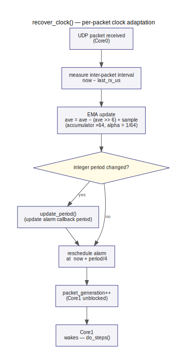

# Clock sync & timing

How the RP2040 tracks the LinuxCNC servo period and keeps Core1 ticking in phase.



---

## Why adaptive clocking?

LinuxCNC's servo period is configured at startup (typically 1 ms) but the actual
inter-packet interval seen by the RP2040 varies slightly due to OS scheduling jitter on
the PC side and network transit time. If Core1 used a fixed-period alarm it would
gradually drift in or out of phase with packet arrivals, causing systematic overruns or
underruns. `recover_clock()` is called on every received packet to keep the alarm
frequency matched to the observed packet rate.

---

## EMA formula

The inter-packet interval is smoothed with an exponential moving average (EMA):

```
ave_period_us_x64 = ave_period_us_x64 - (ave_period_us_x64 >> 6) + sample_us
```

The accumulator stores the average multiplied by 64 (`×64` fixed-point), giving sub-µs
precision without floating-point arithmetic. Alpha = 1/64 ≈ 0.016, which gives slow
convergence — about 64 samples to track a 1/e step change — deliberately trading fast
adaptation for immunity to single-packet jitter.

The integer period in microseconds is `ave_period_us_x64 >> 6`. `update_period()` is
called only when this integer value changes, avoiding unnecessary alarm reschedules.

---

## Phase-lock

On every packet arrival `recover_clock()` cancels the current hardware alarm and
reschedules it to fire at:

```
now + period / 4
```

where `now` is the timestamp of the just-received packet and `period` is the current EMA
estimate.

Firing at `period/4` after each packet arrival places the Core1 tick midway between two
consecutive packet arrivals in the worst-case scenario, maximising the margin before
either an overrun (tick fires before the next packet's config is written) or an underrun
(packet arrives before the tick fires). This keeps overrun and underrun rates symmetric.

---

## Core0/Core1 handoff

`packet_generation` is a `volatile uint32_t` written exclusively by Core0 and read by
Core1. The protocol:

1. Core0 processes all messages from one packet and writes the resulting config.
2. Core0 increments `packet_generation`.
3. Core1 (already woken by the alarm) spins in a tight loop until `packet_generation`
   differs from the value it saw on the previous iteration.
4. Core1 proceeds with the guarantee that all config from this packet is visible.

This single-producer/single-consumer flag replaces a mutex for the critical config hand-
off: Core0 writes config and then releases Core1 with one atomic increment.

---

## Overrun and underrun

- **Overrun** — Core1's tick fires, but `packet_generation` has already advanced *more
  than once* since the last tick. Core1 missed a packet's worth of steps. Tracked per
  joint in `config.joint[N].overrun_count`; reported to the driver as
  `REPLY_JOINT_METRICS.overrun_occurred` and exposed as the `update-overrun` HAL pin
  (EMA of the flag, updated each servo cycle).

- **Underrun** — Core1's tick fires but `packet_generation` has not advanced yet — the
  packet arrived late. Core1 spins briefly until the counter advances. Tracked as
  `underrun_count`; reported as `update-underrun`.

A small, stable idle overrun/underrun rate (~0.04 idle, ~0.08 under motion) is normal
and reflects unavoidable timer phase jitter relative to the packet arrival time.
