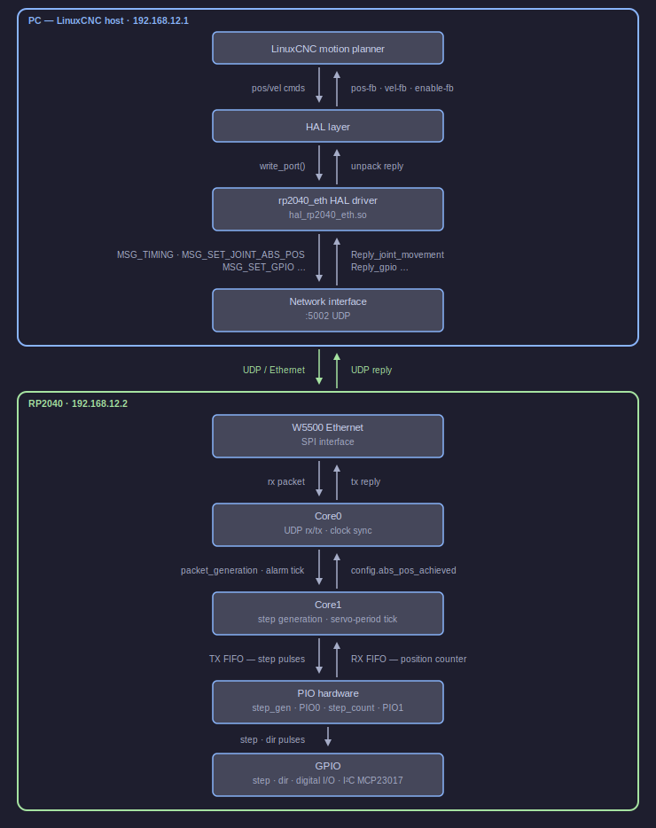

# Architecture overview

rp2040_pio_stepper connects a PC running LinuxCNC to an RP2040-based stepper controller
over UDP/Ethernet. The PC sends joint positions every servo period; the RP2040 converts
them to step/direction pulses via PIO hardware and replies with position feedback.

---

## Components

### LinuxCNC / HAL

LinuxCNC is a real-time CNC controller. Its Hardware Abstraction Layer (HAL) provides a
pin-based interface between the motion planner and hardware drivers. Every servo period
(typically 1 ms) LinuxCNC calls each loaded driver to exchange position commands and
feedback. All HAL pins exposed by this driver are documented in [HAL Pin Reference](hal_reference.md).

### rp2040_eth HAL driver (`hal_rp2040_eth.so`)

The driver is a LinuxCNC realtime module loaded into the HAL. On startup it allocates all
HAL pins and opens a UDP socket. Each servo period LinuxCNC calls `write_port()`, which
serialises the current joint positions, velocities, and GPIO states into one or more
`MSG_*` messages, stamps a sequence number (`seq-out`), and sends them to the RP2040. It
then receives the reply, unpacks it into HAL output pins, and returns.

### W5500 Ethernet

The W5500 is an SPI-connected hardware Ethernet/UDP offload chip. It provides a complete
UDP socket abstraction to the RP2040 firmware, handling framing, checksums, and ARP
internally. The RP2040 reads and writes raw UDP payloads via SPI.

### Core0 — networking and clock sync

Core0 blocks on UDP receive. When a packet arrives it dispatches each message to the
appropriate config update function, then increments `packet_generation` to unblock Core1,
serialises a reply containing position feedback and diagnostics, and sends it back. Between
these steps it runs `recover_clock()` to keep the hardware alarm that drives Core1 in
phase with the LinuxCNC servo period.

### Core1 — step generation

Core1 waits for the hardware alarm tick (fired by Core0's clock-sync logic) and then spins
until `packet_generation` advances, guaranteeing it sees fresh config before generating
steps. It calls `do_steps()` for each enabled joint, which converts the requested velocity
into a pulse-length and pushes step commands to PIO0's TX FIFO.

### PIO hardware

Each joint uses two PIO state machines:

- **`step_gen`** (PIO0) — reads a packed word from the TX FIFO encoding pulse length and
  direction, then generates a square-wave step pulse on the step GPIO pin.
- **`step_count`** (PIO1) — counts rising edges on the step pin, increments or decrements
  a 32-bit counter based on the direction pin, and pushes the result to the RX FIFO.

Four joints occupy four state machines on each PIO block.

---

## Further reading

- [Message Flow](arch/message-flow.md) — one complete servo period, end to end
- [Clock Sync & Timing](arch/timing.md) — how the RP2040 tracks the LinuxCNC servo period
- [PIO Step Generation](arch/pio-stepgen.md) — PIO state machines and step maths
- [HAL Pin Reference](hal_reference.md) — all HAL pins and params with descriptions
